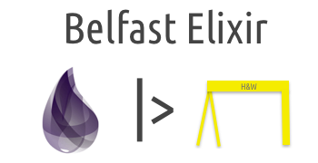

# belfast elixir 



## Description

The home page of the Belfast Elixir Group. Yes, it is written in
[jeykll](http://jekyll.rb). If you don't like it give us a Pull Request 😀

## Links
[belfastelixir.org](https://www.belfastelixir.org)

## Development Info

```
bundle install 
jekyll serve
```

### Pull Requests

Pull Requests are not just welcomed but encouraged. If you see a spelling
mistake - issue a pull request. If you want to add a new blog post - issue a
pull request. We use the `GitHub Flow` so make a branch of `master` and be
descriptive in your PR (extra points for a descriptive branch name e.g.
`new-blog-post-for-something`, `fix-spelling-mistake`). The PR will then be
reviewed and if all is ok it will be merged and deployed to master. 
